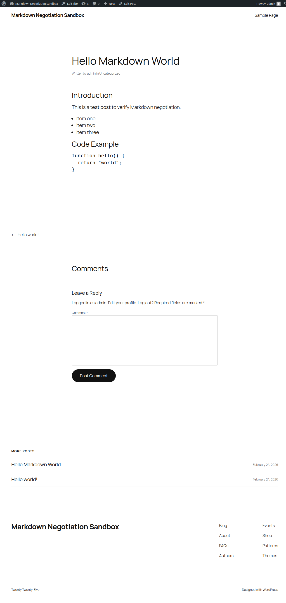
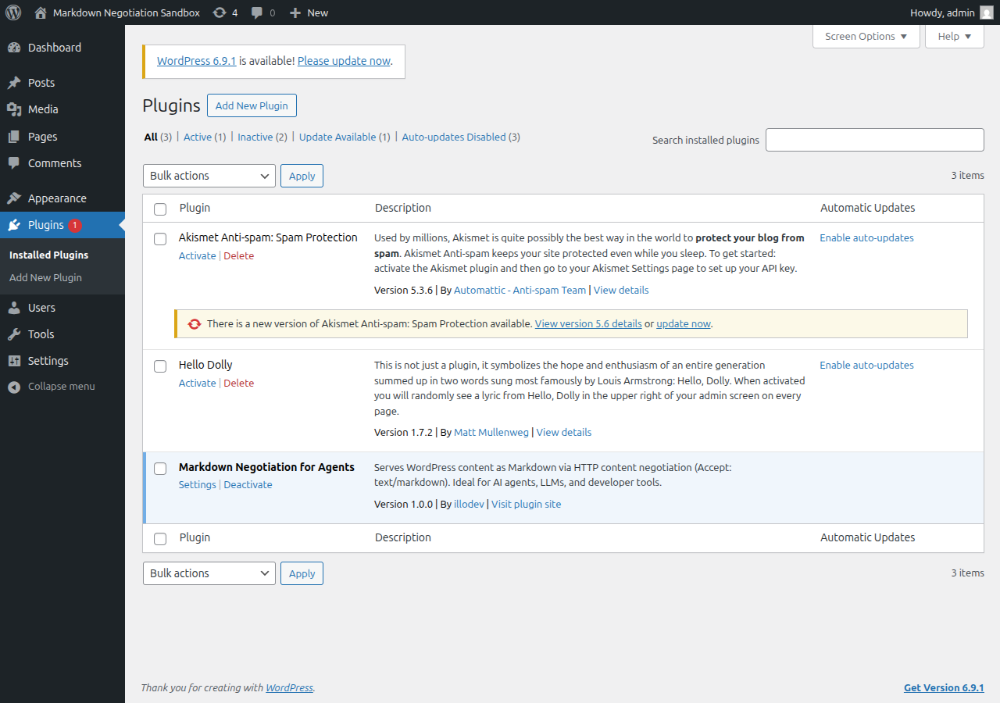
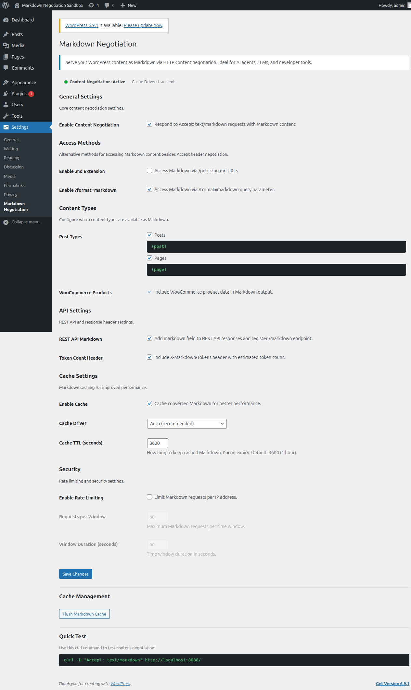
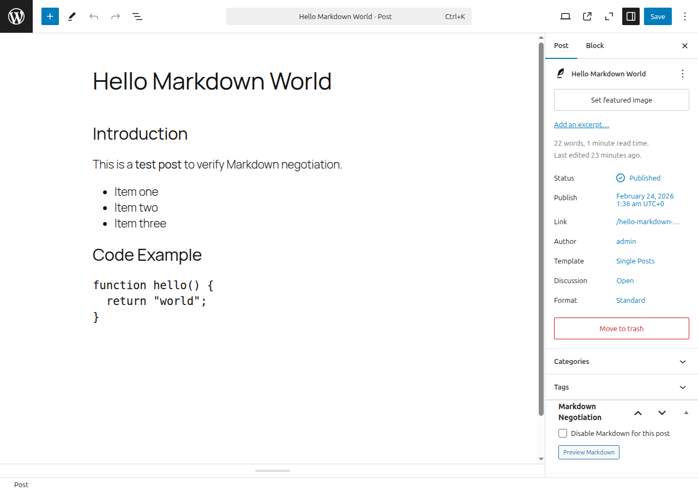
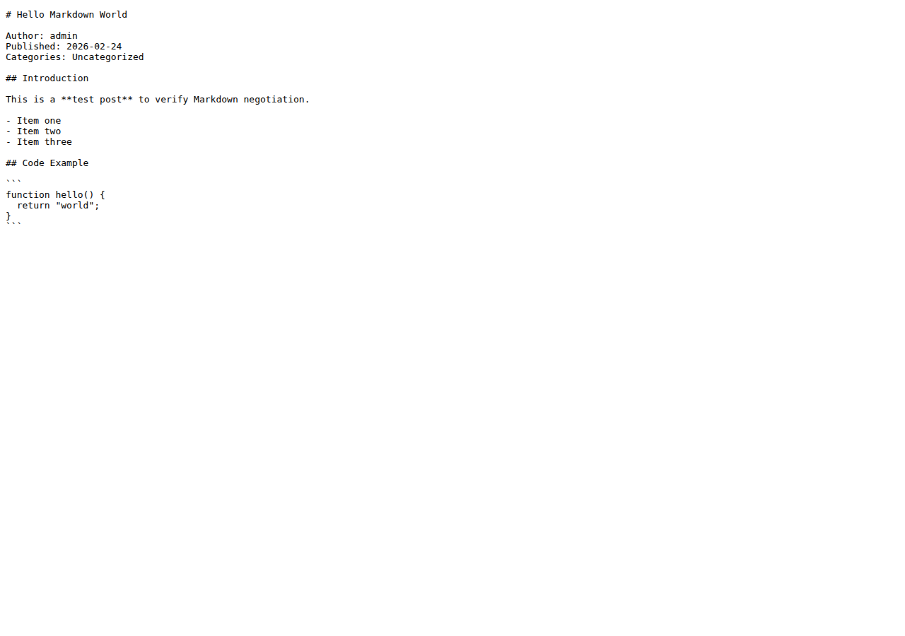
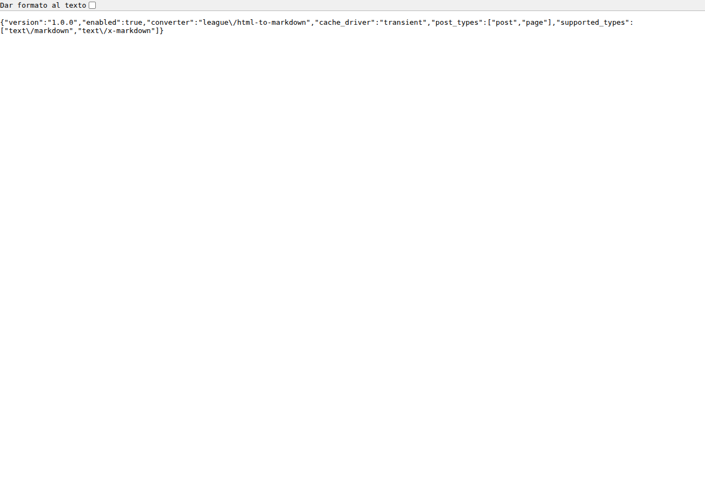
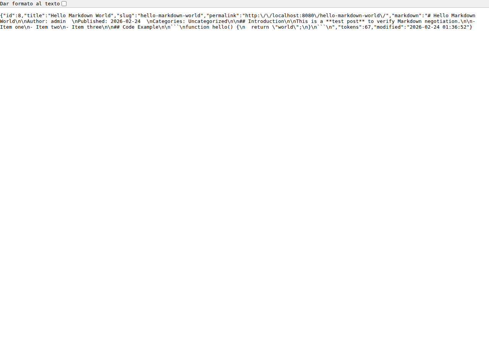

# Screenshots

Visual reference for **Markdown Negotiation for Agents** plugin documentation.

---

## 01 — Post rendered as HTML

Standard WordPress frontend. The post is served with `Content-Type: text/html` to regular browsers.



---

## 02 — WordPress Plugins page

The plugin appears as **active** in the Plugins admin page.



---

## 03 — Plugin Settings page

Full settings panel at **Settings → Markdown Negotiation** (`options-general.php?page=jetstaa-mna-settings`).  
Key sections: General Settings, Access Methods, Content Types, API Settings, Cache Settings, Security.



---

## 04 — Post editor with Meta Box

The **Markdown Negotiation** meta box in the Gutenberg sidebar allows disabling Markdown per-post and previewing the Markdown output.



---

## 05 — Markdown response in browser (`?format=markdown`)

Accessing a post with `?format=markdown` returns the raw Markdown content directly, even without setting the `Accept` header.



---

## 06 — REST API status endpoint

`GET /wp-json/jetstaa-mna/v1/status` returns plugin status, converter library, cache driver, and supported content types.



---

## 07 — REST API markdown endpoint

`GET /wp-json/jetstaa-mna/v1/markdown/{id}` returns a full JSON payload with the Markdown content, token count, and metadata.



---

## HTTP Response headers reference

When a client sends `Accept: text/markdown`, the plugin responds with:

```
HTTP/1.1 200 OK
Content-Type: text/markdown; charset=utf-8
Vary: Accept
X-Markdown-Source: wordpress-plugin
X-Markdown-Plugin-Version: 1.0.0
X-Markdown-Tokens: 67
Link: <https://example.com/post-slug/>; rel="alternate"; type="text/markdown"
Cache-Control: public, max-age=300, s-maxage=3600
```

Example curl command:

```bash
curl -si -H "Accept: text/markdown" https://example.com/your-post-slug/
```
